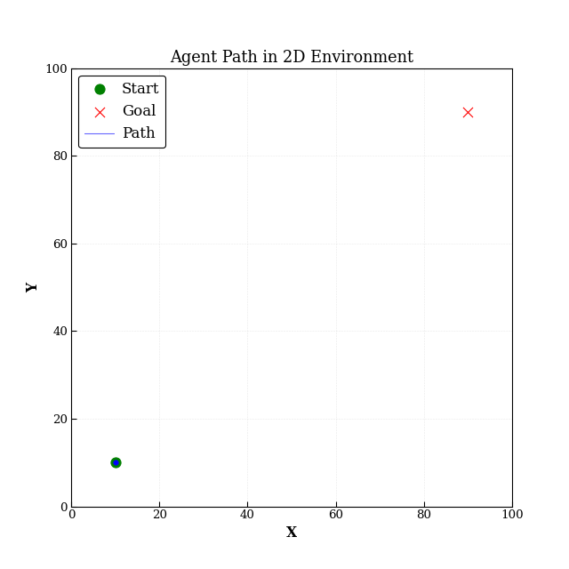

# 강화학습 기반 Path Planning 알고리즘 구현 Repository

심층강화학습(DRL) 기반의 Path Planning 알고리즘을 구현하는 것을 목표로 한다.  

심플한 2D 및 3D 그리드 환경에서 에이전트가 목표 지점까지 이동하는 문제를 다루며,  
현재 DQN(Deep Q-Network) 알고리즘을 사용하여 에이전트를 학습시킨다.  

# 향후 알고리즘 추가 계획

- Single-Agent
    - [ ] PPO(Proximal Policy Optimization)
    - [ ] A3C(Asynchronous Advantage Actor-Critic)
    - [ ] DDPG(Deep Deterministic Policy Gradient)
    - [ ] SAC(Soft Actor-Critic)
    
- Multi-Agent
    - [ ] IQN(Independent Q-Learning)
    - [ ] VDN(Value Decomposition Networks)
    - [ ] MADDPG(Multi-Agent Deep Deterministic Policy Gradient)
    - [ ] QMIX
    - [ ] COMA(Counterfactual Multi-Agent Policy Gradients)


# 주요 파일 설명
- `src/envs/`: 2D 및 3D 그리드 환경 구현
- `src/algorithms/`: 강화학습 알고리즘 구현
- `train.py`: 에이전트 학습
- `test.py`: 학습된 에이전트 환경 평가 및 시각화

# 사용법
1. 의존성 설치  
   ```bash
   pip install -r requirements.txt
   ```
2. 에이전트 학습  
   ```bash  
    python train.py --algo dqn
    ```
3. 에이전트 평가
    ```bash  
     python test.py --model_path path_to_trained_model.pth
     ```

# 시뮬레이션 결과

### 2D 환경 - DQN

Model Path: db\saves\dqn\20251223_141101\final.pth



Kyounghun Kim  
kyounghun2848@gmail.com  